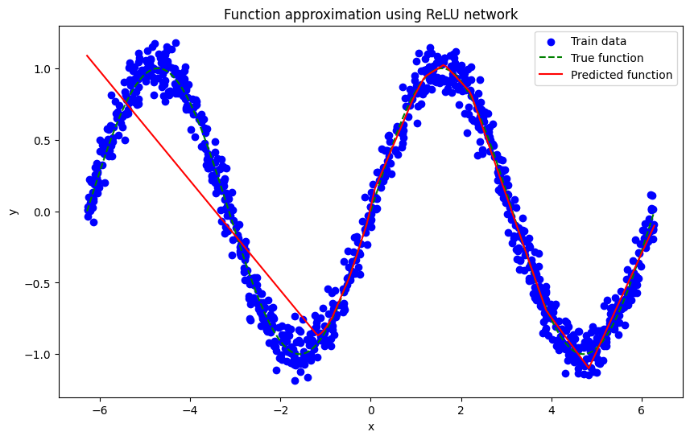

# Report：使用ReLU神经网络拟合正弦函数

##### 2151400 麻开菁

## 1. 函数定义
在本项目中，我尝试使用一个简单的神经网络来拟合一个基本的数学函数——正弦函数。正弦函数是一个周期函数，其定义如下：

$$
f(x) = \sin(x)
$$


## 2. 数据采集

为了训练和测试我们的神经网络，首先需要生成对应的数据集。我使用NumPy库来生成数据：

- 训练集：包含1000个样本，每个样本的x值在$[-2\pi, 2\pi]$范围内均匀分布。为了模拟噪声，我在每个y值（即$\sin(x)$）上添加了均值为0，标准差为0.1的高斯噪声。
- 测试集：包含200个样本，x值在相同的范围内均匀分布。测试集用于在训练完成后评估模型的拟合效果。

```python
# 生成训练集和测试集
num_train_samples = 1000
num_test_samples = 200
x_train = np.random.uniform(-2*np.pi, 2*np.pi, size=(num_train_samples, 1))
y_train = true_function(x_train) + np.random.normal(loc=0, scale=0.1, size=(num_train_samples, 1))
x_test = np.linspace(-2*np.pi, 2*np.pi, num_test_samples).reshape(-1, 1)
y_test = true_function(x_test)
``` 

## 3. 模型描述

构建了一个包含一个隐藏层的神经网络模型，该模型使用ReLU作为激活函数。模型的结构如下：

- 输入层：接受一个特征的输入（即x值）。
- 隐藏层：包含100个神经元，使用ReLU激活函数。
- 输出层：输出一个特征，即预测的y值。

模型的权重和偏置在初始化时随机生成，训练过程中通过梯度下降算法进行更新。

```python
class ReLU_Network:
    def __init__(self):
        self.W1 = tf.Variable(tf.random.normal([1, 100]), dtype=tf.float32)
        self.b1 = tf.Variable(tf.zeros([100]), dtype=tf.float32)
        self.W2 = tf.Variable(tf.random.normal([100, 1]), dtype=tf.float32)
        self.b2 = tf.Variable(tf.zeros([1]), dtype=tf.float32)

    def __call__(self, x):
        hidden_layer = tf.nn.relu(tf.matmul(x, self.W1) + self.b1)
        output = tf.matmul(hidden_layer, self.W2) + self.b2
        return output
```

## 4. 训练测试

为了训练模型，我们使用了Adam优化器，并设置了学习率为0.01。模型在2000个epoch后完成训练。在每个epoch结束时，我们打印出当前的损失值，以便监控训练过程。

```python
# 训练模型
def train_model(model, x_train, y_train, epochs=100, learning_rate=0.01):
    optimizer = tf.optimizers.Adam(learning_rate=learning_rate)
    for epoch in range(epochs):
        with tf.GradientTape() as tape:
            predictions = model(x_train)
            loss = tf.reduce_mean(tf.square(predictions - y_train))
        gradients = tape.gradient(loss, [model.W1, model.b1, model.W2, model.b2])
        optimizer.apply_gradients(zip(gradients, [model.W1, model.b1, model.W2, model.b2]))
        if epoch % 10 == 0:
            print("Epoch {}, Loss: {:.4f}".format(epoch, loss.numpy()))
```

训练完成后，我们在测试集上评估了模型的性能。测试集上的损失值用于衡量模型对真实函数的拟合程度。

```python
# 测试模型
def test_model(model, x_test, y_test):
    predictions = model(x_test)
    test_loss = tf.reduce_mean(tf.square(predictions - y_test))
    print("Test Loss: {:.4f}".format(test_loss.numpy()))
```

## 6. 拟合效果

使用matplotlib库来可视化训练数据、真实函数以及模型预测的结果。通过图表，我们可以直观地看到模型在拟合正弦函数方面的表现。

