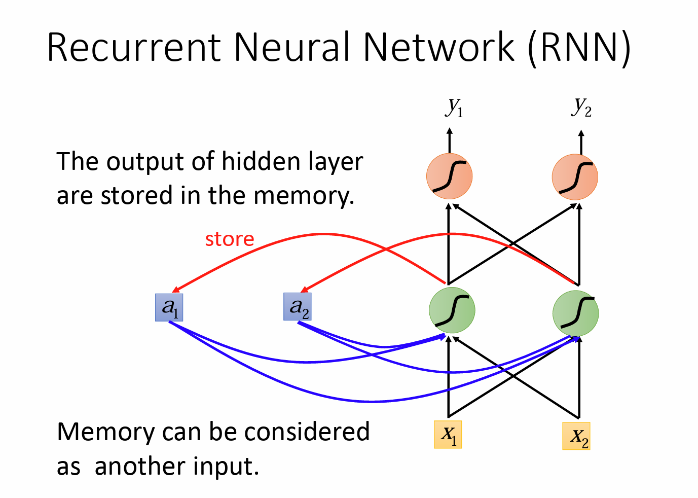
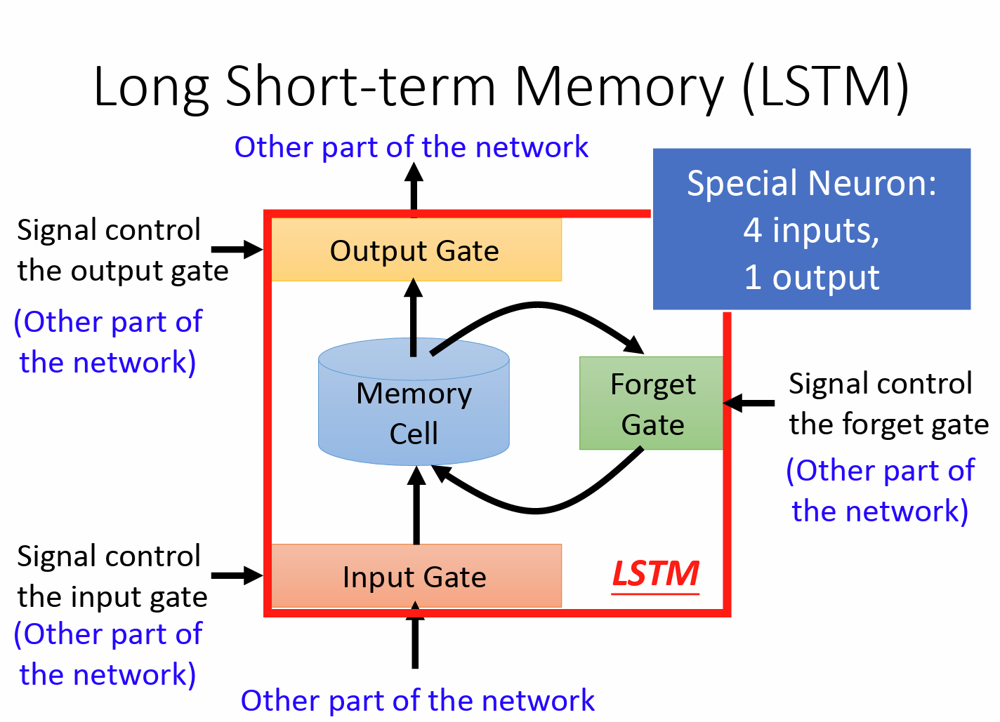
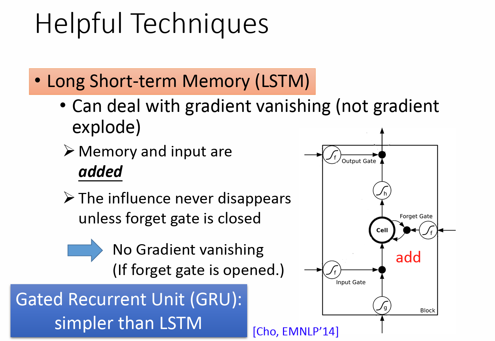
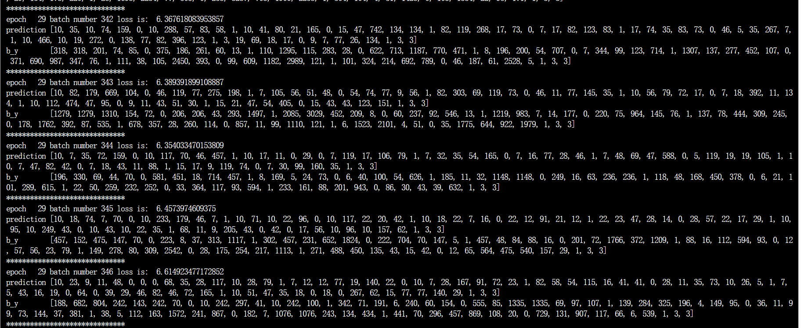
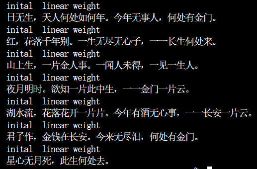

# Report：使用RNN、LSTM和GRU模型生成唐诗

##### 2151400 麻开菁

##  1. RNN ，LSTM，GRU模型

https://zhuanlan.zhihu.com/p/460770357

### RNN

RNN（循环神经网络，Recurrent Neural Network）是一种用于处理序列数据的神经网络架构。与传统的前馈神经网络不同，RNN能够处理变长的序列输入，这使得它在自然语言处理、语音识别、时间序列分析等领域非常有用。

RNN的核心思想在于网络中存在着循环，即网络的输出不仅依赖于当前输入，还依赖于之前的状态。这种设计让RNN能够保持一定的记忆能力，从而捕捉序列中的时间动态信息。

RNN的主要组成部分包括：

隐藏状态（Hidden State）：这是RNN的“记忆”部分，它携带并更新序列中的时间信息。
输入权重（Input Weights）：决定当前输入对隐藏状态的影响。
隐藏权重（Hidden Weights）：决定前一个隐藏状态对当前隐藏状态的影响。

RNN的工作流程通常如下：

1. 在每个时间步，RNN接收一个输入向量，并结合当前的隐藏状态。
2. 使用输入权重和隐藏权重，计算新的隐藏状态。
3. 生成输出，这个输出可以直接作为当前时间步的输出，也可以用于进一步的处理。
4. 更新隐藏状态，以便在下一个时间步使用。
5. 重复上述步骤，直到处理完整个序列。

### LSTM

LSTM（长短期记忆网络，Long Short-Term Memory）是一种常用的循环神经网络（RNN）的变体，用于处理序列数据和时间序列数据的建模和预测。

LSTM的设计目的是解决传统RNN中的梯度消失和梯度爆炸问题，使得模型能够更好地捕捉长期依赖关系。LSTM通过引入称为“门控机制”的组件来实现这一点。

LSTM中的主要组件包括：

1. 细胞状态（Cell State）：用于存储和传递信息的长期记忆。
2. 输入门（Input Gate）：决定哪些信息需要被更新到细胞状态中。
3. 遗忘门（Forget Gate）：决定哪些信息需要从细胞状态中删除。
4. 输出门（Output Gate）：决定细胞状态中的信息如何被输出。

LSTM的工作流程如下：

1. 输入门根据当前输入和前一个时间步的隐藏状态决定哪些信息需要更新到细胞状态中。
2. 遗忘门根据当前输入和前一个时间步的隐藏状态决定哪些信息需要从细胞状态中删除。
3. 根据输入门和遗忘门的结果，更新细胞状态。
4. 输出门根据当前输入和前一个时间步的隐藏状态决定细胞状态中的哪些信息需要被输出。
5. 根据输出门的结果，生成当前时间步的隐藏状态。
6. 重复上述步骤，处理序列中的每个时间步。

LSTM在自然语言处理、语音识别、机器翻译等任务中取得了很好的效果。它能够捕捉长期依赖关系，有效地处理序列数据中的上下文信息。

### GRU

GRU（门控循环单元，Gated Recurrent Unit）是循环神经网络（RNN）的一种重要变体，由Cho等人在2014年提出。GRU旨在解决传统RNN在处理长序列时出现的梯度消失和梯度爆炸问题，同时简化了LSTM的结构，使其更加轻量级。

GRU的核心思想是通过两个门控机制——更新门（Update Gate）和重置门（Reset Gate）——来控制信息的流动。这两个门决定了哪些信息应该被传递到下一个时间步，以及哪些信息应该被遗忘。

GRU的主要组件：

1. 重置门（Reset Gate）：

    决定当前时间步的输入应该在多大程度上影响过去的隐藏状态。
    重置门的输出范围在0到1之间，接近0表示忽略当前输入，接近1表示完全采用当前输入。

2. 更新门（Update Gate）：

    决定新计算的候选隐藏状态应该在多大程度上替代旧的隐藏状态。
    更新门同样输出一个介于0到1之间的值，接近0表示保留旧状态，接近1表示接受新状态。

3. 候选隐藏状态（Candidate Hidden State）：

    这是通过当前输入和重置门的输出结合旧的隐藏状态计算得到的，代表了当前时间步可能更新的隐藏状态。

工作流程：

1. 在每个时间步，GRU首先计算重置门和更新门。
2. 利用重置门的结果调整当前输入，得到一个修正后的输入。
3. 将修正后的输入与旧的隐藏状态结合，计算候选隐藏状态。
4. 最后，利用更新门的结果决定是保留旧的隐藏状态还是更新为候选隐藏状态。

GRU的优势在于它的结构相对简单，参数数量较少，这使得它在处理长序列时更加高效，并且能够快速训练。同时，GRU在很多任务中表现出与LSTM相当甚至更好的性能，尤其是在处理较短序列或者资源受限的情况下。

##  2. 诗歌生成的过程

###  环境问题
上一次因为使用tensorflow2.x导致很多东西很麻烦，这一次降低版本到1.x来运行。
同时发现在jupyter notebook中运行代码，会出现这个问题:AttributeError: ‘Tensor’ object has no attribute ‘numpy’
原因：
numpy方法只用在使用tf.enable_eager_execution()(命令式编程开启)后才有的方法, 否则会有==AttributeError: ‘Tensor’ object has no attribute ‘numpy’==报错

总结： Tensor.numpy() 只能在终端执行代码或者在终端调用代码才有效（这时候会默认开启eager_execution），而在jupyter-notebook 中没有开启，所以就会报这个错误，所以在代码前面加了tf.enable_eager_execution() 

### tensorflow版本

#### 数据处理

1. 读取数据：process_dataset 函数负责读取诗歌文本文件（poems.txt），并对每一行进行处理。每行文本被分割成两部分：标签（: 前的内容）和内容（: 后的内容）。

2. 文本编码：将文本内容转换为一系列的词汇索引。首先，定义了特殊的开始（bos）和结束（eos）标记，并将它们添加到文本的开始和结束位置。

3. 词汇表构建：统计所有文本中的词汇，并创建一个词汇表（word2id），将每个词汇映射到一个唯一的索引。

4. 数据格式化：将文本序列转换为索引序列，并根据最大序列长度进行截断或填充。

5. 数据集创建：poem_dataset 函数将处理后的数据转换为TensorFlow数据集（tf.data.Dataset），并进行打乱和批量处理。

#### 模型定义

1. 嵌入层：myRNNModel 类中的 embed_layer 将词汇索引转换为固定大小的嵌入向量。

2. RNN层：使用 SimpleRNNCell 作为循环单元，并堆叠成 RNN 层，以便处理序列数据。

3. 输出层：一个全连接层（Dense），将RNN的输出转换为词汇空间的概率分布。

#### 训练过程

1. 损失函数：compute_loss 函数计算模型输出和真实标签之间的交叉熵损失，并通过序列长度进行加权平均。

2. 优化器：使用Adam优化器来更新模型的权重。

3. 训练循环：train_one_step 函数执行单步训练，计算损失并应用梯度更新。

4. 训练循环：train 函数执行多个训练周期（epoch），在每个周期中遍历整个数据集。

#### 文本生成

1. 初始化状态：生成过程开始时，初始化RNN的状态。

2. 生成词汇：从特殊的开始标记（bos）开始，迭代地生成下一个词汇，直到达到最大长度或生成结束标记（eos）。

3. 收集输出：将生成的词汇索引转换回文本形式，并拼接成完整的诗歌。

### Pytorch版本

因为在CPU上训练较慢，故自行实现了可在GPU上运行的版本。

#### 数据预处理

1. 读取诗歌：process_poems1 和 process_poems2 函数用于读取诗歌文件，并对每行诗歌进行清洗和格式化。清洗包括去除特殊字符和标点符号，确保诗歌内容的一致性。

2. 构建词汇表：统计所有诗歌中的字（中文字符），并创建一个词汇表（word_int_map），将每个字映射到一个唯一的索引。

3. 诗歌向量化：将诗歌转换为字索引的序列，以便模型能够处理。

4. 生成批次数据：generate_batch 函数将诗歌向量化后的数据分割成多个批次，用于模型训练。

#### 模型定义

1. 词嵌入层（word_embedding）：将字索引转换为固定大小的嵌入向量。

2. RNN层（self.rnn_lstm）：使用LSTM（长短期记忆网络）作为循环单元，处理序列数据。

3. 全连接层（self.fc）：将RNN的输出转换为词汇空间的概率分布。

4. 激活函数：使用LogSoftmax激活函数来计算输出的概率分布。

#### 训练过程

1. 损失函数：使用负对数似然损失（NLLLoss）来衡量模型输出和真实标签之间的差异。

2. 优化器：使用RMSprop优化器来更新模型的权重。

3. 训练循环：run_training 函数执行多个训练周期（epoch），在每个周期中遍历整个数据集的批次。

    - 在每个批次中，模型接收输入序列（x）并预测下一个字（y）。
    - 计算损失并进行反向传播（backpropagation）。
    - 更新模型的权重。

4. 模型保存：在训练过程中，定期保存模型状态，以便后续使用。

#### 文本生成

1. 生成诗歌：gen_poem 函数使用训练好的模型来生成新的诗歌。它从一个给定的起始字开始，迭代地预测下一个字，直到达到结束标记（end_token）或诗歌长度超过限制。

2. 结果展示：pretty_print_poem 函数用于格式化生成的诗歌，使其更符合诗歌的排版。

## 3. 生成诗歌 开头词汇是 “ 日 、 红 、 山 、 夜 、 湖、 海 、 月 ” ，等词汇作为begin word

训练过程的截图

生成诗歌的结果

